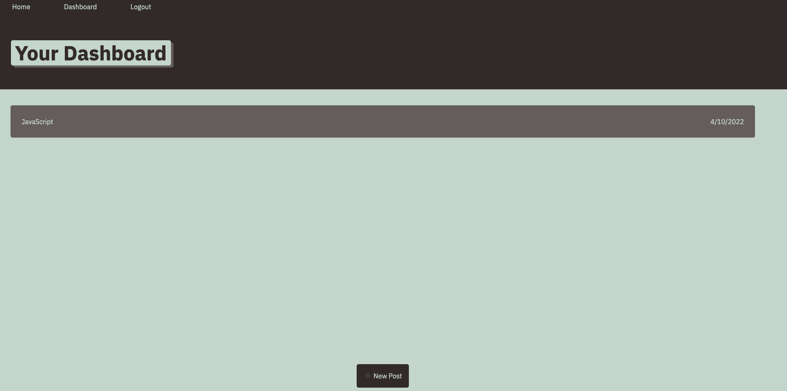

# Tech Blog

## Description
This technology focused blog application that I created allows users to post text entries to a dashboard based off of new technologies and ideas around the tech idustry that excite them! People from around the world can sign up and post/comment on other usuers entries as well. Come join this community of intellectuals and friends!

## Installation
Run npm Install in terminal to downlaod all the dependencies needed to run the application.

## Screenshot

## License

## Contact:
+ [Github](https://github.com/Akaiafas526)

+ [Email](akaiafas526@gmail.com)

https://github.com/Akaiafas526/Tech_Blog
